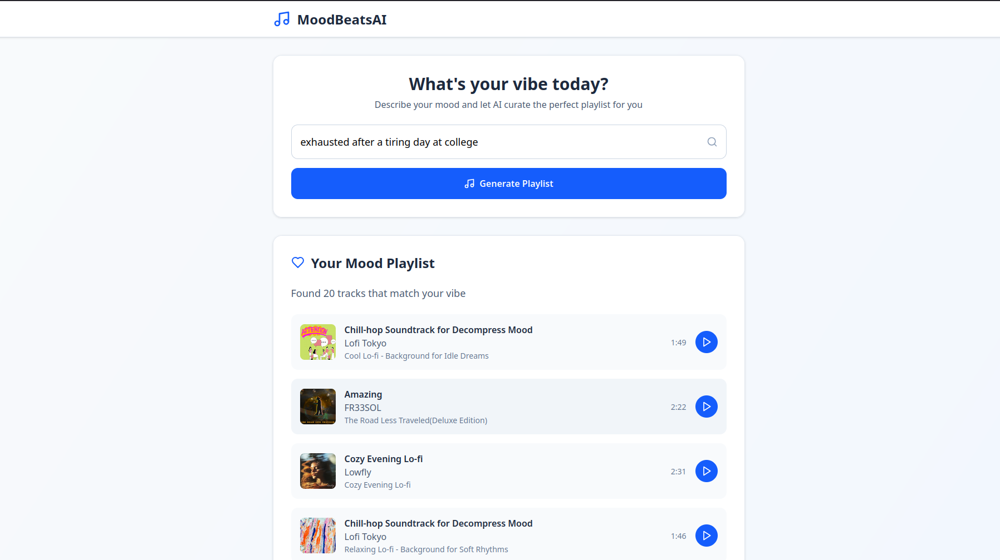

# MoodBeatsAI

MoodBeatsAI is a web application that leverages AI to generate playlists based on your mood. The project consists of a React frontend and an Express backend.

## Features

- 🎵 AI-powered music recommendations
- 😃 Mood-based song selection
- ⚡ Fast and modern UI built with Vite + React
- 🔗 RESTful API backend with Node.js

## Getting Started

### Prerequisites

- [Node.js](https://nodejs.org/)
- [pnpm](https://pnpm.io/)

### Setup

#### 1. Clone the repository

```sh
git clone https://github.com/TheChilledBuffalo/moodbeats-ai.git
cd moodbeats-ai
```

### 2. Install Dependencies

#### Frontend

```sh
cd client
pnpm install
```

#### Backend

```sh
cd server
pnpm install
```

### 3. Environment Variables

Create a .env file in the server directory with the following keys:

```
GEMINI_API_KEY=
SPOTIFY_CLIENT_ID=
SPOTIFY_CLIENT_SECRET=
```

### 4. Run the development servers

Run `pnpm run dev` in both the `client` and `server` directories simultaneously.

The frontend will be available at http://localhost:5173/ and the backend at http://localhost:4560/.

## Screenshots
